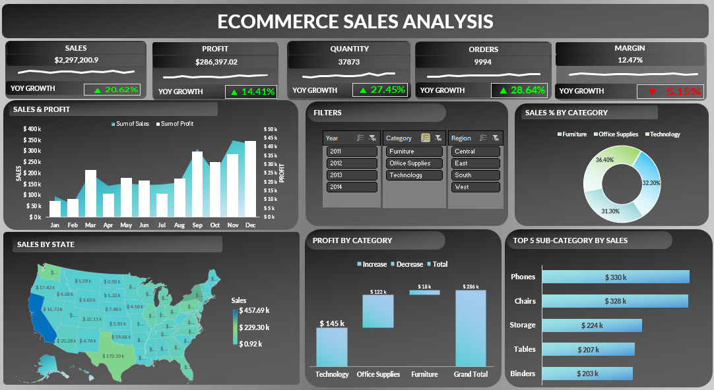

# 📊 Ecommerce Sales Analysis Dashboard (Excel, PowerPivot, DAX)

## 📌 Project Overview

This project presents a **dynamic Ecommerce Sales Dashboard** built in Microsoft Excel to analyze sales performance, profitability, and regional trends.

The dashboard enables stakeholders to make **data-driven decisions** through interactive filtering and clear visual insights.

## 📂 Dataset Details

* Dataset: Ecommerce sales data
* Key Fields:

  * Order Date (Year-wise analysis)
  * Sales, Profit, Quantity
  * Category & Sub-Category
  * Region & State

---

## 🛠 Tools & Technologies Used

* Microsoft Excel

  * Pivot Tables
  * Pivot Charts
  * Slicers
  * Map Chart
  * Waterfall Chart
* Data Cleaning & Transformation

---

## 🧹 Data Preparation

* Cleaned dataset by removing duplicates and handling missing values
* Standardized formats (dates, categories, regions)
* Created calculated fields:

  * **Sales**
  * **Profit**
  * **Profit Margin (%)**
* Built structured data model for analysis

---

## 📊 Dashboard & Visuals

### 🎯 KPIs

* 💰 Total Sales: **$2.29M**
* 💵 Total Profit: **$286K**
* 📦 Total Orders: **9,994**
* 🛒 Total Quantity: **37,873**
* 📊 Profit Margin: **12.47%**

### 🎛️ Filters (Slicers)

* Year
* Category
* Region

### 📈 Visualizations

1. 📉 **Sales & Profit Trend** – Line Chart
2. 🥧 **Sales % by Category** – Pie Chart
3. 🗺️ **Sales by State** – Map Visualization
4. 📊 **Profit by Category** – Waterfall Chart
5. 🏆 **Top 5 Sub-Categories by Sales** – Bar Chart

### 🧱 Data Model

* Created **2 Pivot Tables:**

  * 📊 Pivot for all visualizations
  * 📌 Pivot for KPI calculations

## 🔍 Key Findings

* Technology and Office Supplies contribute the highest revenue
* Sales show consistent growth toward year-end (Q4 peak)
* Certain states outperform others significantly in sales
* A few sub-categories (Phones, Chairs) dominate total sales
* Profit margins vary across categories, highlighting optimization opportunities

---

## 💡 Recommendations

* Focus marketing efforts on **top-performing categories**
* Improve profitability in lower-margin categories
* Expand operations in **high-performing states**
* Optimize inventory for **top-selling sub-categories**
* Investigate underperforming regions for growth opportunities

---

## 📈 Business Impact

* Enables quick identification of **revenue drivers**
* Supports **strategic decision-making** with real-time insights
* Improves visibility into **regional and category performance**
* Helps optimize **product and sales strategy**

---

## 🚀 Skills Demonstrated

* Data Cleaning & Transformation
* Data Analysis using Excel
* Dashboard Design & Storytelling
* Business Insight Generation
* KPI Development & Tracking
* Data Visualization Best Practices

---

## 📷 Dashboard Preview

---

👤 Author
Anagha Parkhi MS in Business Analytics
Data Analyst | BI Developer

LinkedIn: https://www.linkedin.com/in/anaghaparkhi  
GitHub: https://github.com/anaghaparkhi
